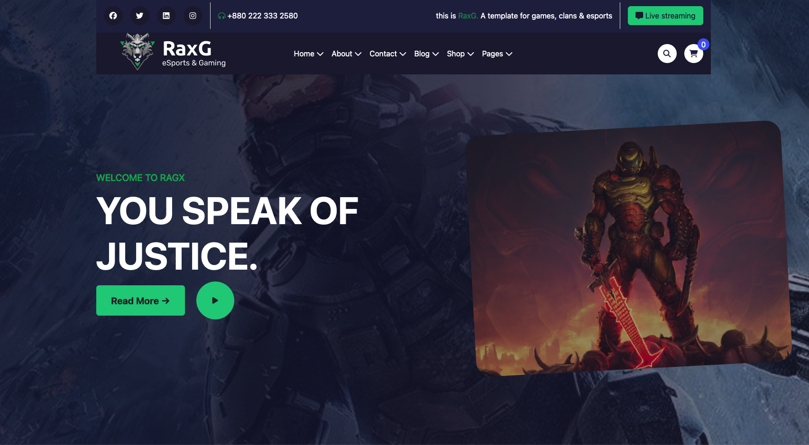
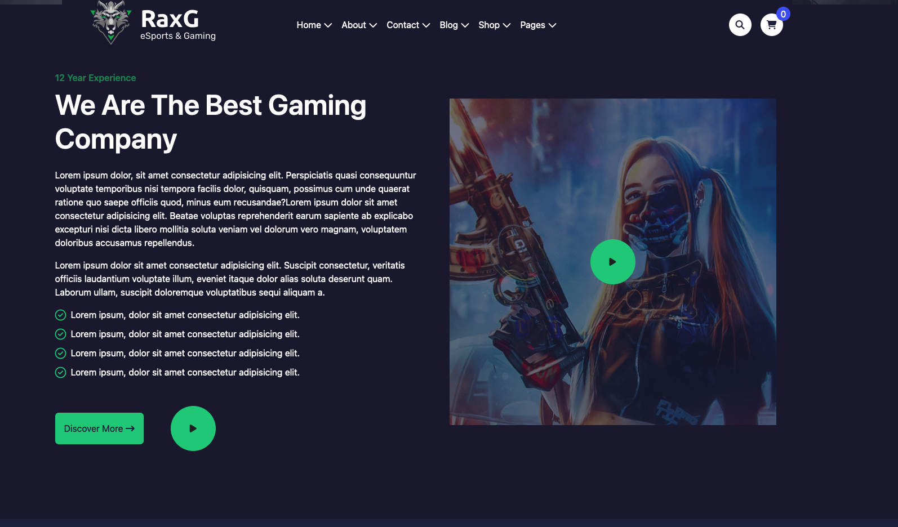
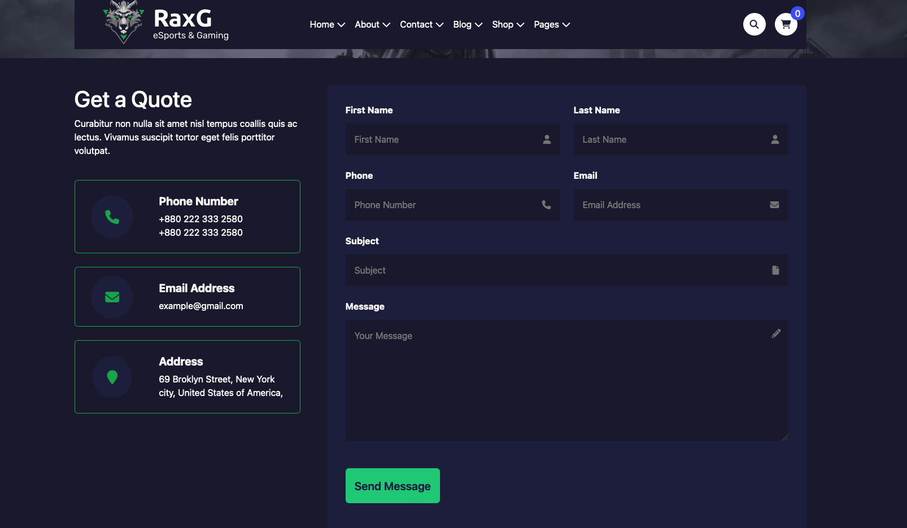

# Midterm Project - README

## Descrizione del Progetto

Questo progetto di midterm consiste nella replica di alcune pagine del sito **RaxG** [NextGenerationDev](https://nextgenerationdev.com/demos/html/raxg/raxg/index-3.html). Le pagine replicate sono:

- Home
- About Us
- Contact

Il progetto è stato sviluppato utilizzando Vite come build tool e le seguenti dipendenze:

- **Vue**: per la costruzione dell'interfaccia utente.
- **Sass**: per la gestione degli stili CSS in modo più efficiente e modulare.
- **Bootstrap**: per un design reattivo e componenti pre-stilizzati.
- **FontAwesome**: per l'integrazione di icone vettoriali scalabili.

## Caratteristiche Tecniche

- **Props**: Utilizzo delle props per passare dati ai componenti figli in modo dinamico.
- **Store**: Gestione dello stato globale dell'applicazione con Vuex.
- **Components**: Scomposizione dell'interfaccia utente in componenti riutilizzabili.
- **Multi-Page**: Implementazione di un'applicazione multi-pagina.
- **Routing**: Navigazione tra le diverse pagine tramite Vue Router.

## Autori

Il progetto è stato realizzato da:

- Luca Maria Cavatassi
- Denis Turbato
- Andrea Bertaglia

## Screenshot delle Pagine

### Home

### About Us

### Contact

---

Questo README offre una panoramica del progetto, le tecnologie utilizzate e gli autori che hanno contribuito alla realizzazione del midterm. Speriamo che il nostro lavoro soddisfi le aspettative e dimostri le competenze acquisite durante il corso.
